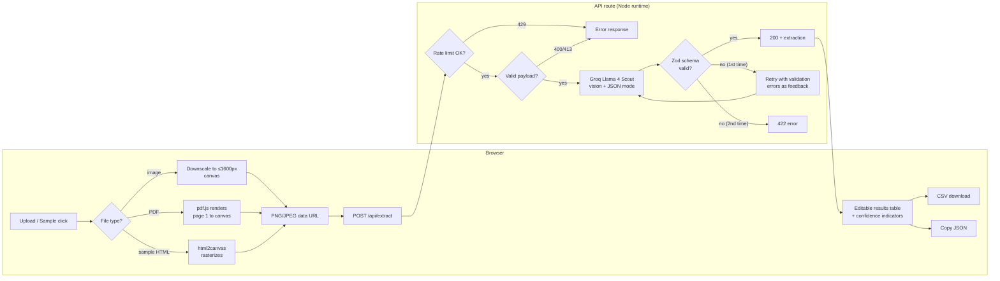

# InvoiceLens 🔍

**Turn documents into data in seconds.** An AI-powered invoice & receipt extraction demo: upload an image or PDF, get clean, schema-validated structured data with per-field confidence scores — editable in the browser and exportable as CSV or JSON.

Built with **Next.js 14 (App Router) · TypeScript · Tailwind CSS · Groq (Llama 4 Scout vision, free tier) · Zod**.

> Works with any OpenAI-compatible provider — Groq is the default because its free tier needs no credit card. Override `AI_BASE_URL` / `AI_MODEL` to use OpenAI, Gemini, etc.

## Features

- 📄 **Single & batch extraction** — process one document, or up to 5 sequentially with a live progress bar and combined CSV export
- 🧾 **Rich field coverage** — vendor, date, invoice number, currency, line items (description / qty / unit price / total), subtotal, tax, grand total
- ✅ **Validated output** — every model response is parsed against a strict Zod schema; on failure the validation errors are fed back to the model for one automatic repair attempt
- 🎯 **Per-field confidence** — the model self-reports a 0–1 confidence per field, surfaced as color-coded indicators (green ≥ 90%, amber ≥ 70%, red below)
- ✏️ **Editable results** — fix any field or line item inline before exporting
- 📤 **Exports** — one-click CSV download and copy-to-clipboard JSON
- 🧪 **Built-in samples** — three fictional invoices (SaaS invoice, café receipt, EU consulting invoice) rendered from styled HTML and pushed through the real AI pipeline
- 📑 **PDF support** — first page rasterized client-side with pdf.js before extraction
- 🛡️ **Hardened API route** — per-IP rate limiting, payload size caps, input validation, descriptive error responses
- 📱 **Mobile responsive**, light SaaS design

## Quick start

```bash
# 1. Install
npm install

# 2. Configure — free key from https://console.groq.com/keys
cp .env.example .env
#    → set GROQ_API_KEY=gsk_...

# 3. Run
npm run dev
```

Open [http://localhost:3000](http://localhost:3000) and click one of the sample invoices to see the full pipeline without uploading anything.

## Deploy to Vercel

1. Push this repo to GitHub.
2. Import it at [vercel.com/new](https://vercel.com/new) — the Next.js preset works as-is.
3. Add the `GROQ_API_KEY` environment variable in **Project Settings → Environment Variables**.
4. Deploy.

> The rate limiter is in-memory (per serverless instance). For production-grade limiting across instances, swap `lib/rateLimit.ts` for Upstash Redis or Vercel KV.

## Architecture



### Key decisions

| Decision | Why |
|---|---|
| All documents normalized to an image **client-side** | One uniform API contract; PDFs and HTML samples never touch the server in raw form; payloads stay small (≤1600 px) |
| `response_format: json_object` + Zod + one repair retry | JSON mode alone doesn't guarantee *your* schema; the retry feeds Zod's actual error messages back to the model |
| Confidence self-reported by the model | Honest signal for a human-review workflow at zero extra cost; low-confidence fields get red/amber dots |
| Sequential batch processing | Stays inside per-IP rate limits and makes the progress bar truthful |
| No database, no document storage | Privacy by default — documents exist only in the request lifecycle |

## Project structure

```
app/
  page.tsx               Landing page (hero, live demo, features)
  layout.tsx             Root layout + metadata
  api/extract/route.ts   Vision extraction endpoint (rate limit → OpenAI → Zod → retry)
components/
  Demo.tsx               Demo orchestrator (single/batch tabs, state machine)
  Dropzone.tsx           Drag & drop upload
  Preview.tsx            Document preview pane (image or sample HTML)
  ResultsTable.tsx       Editable extraction table
  Confidence.tsx         Per-field confidence indicator
  BatchMode.tsx          Sequential multi-file processing + progress
  ExportButtons.tsx      CSV download / copy JSON
lib/
  schema.ts              Zod extraction schema (single source of truth)
  document.ts            Client-side prep: image downscale, PDF→PNG, HTML→PNG
  samples.ts             3 fictional sample invoices as styled HTML
  csv.ts                 CSV flattening & download helpers
  rateLimit.ts           In-memory per-IP fixed-window limiter
  api.ts                 Typed client for /api/extract
```

## Environment variables

| Variable | Required | Default | Description |
|---|---|---|---|
| `GROQ_API_KEY` | ✅ | — | Groq API key (server-side only, free at console.groq.com) |
| `AI_BASE_URL` | — | `https://api.groq.com/openai/v1` | Any OpenAI-compatible endpoint |
| `AI_MODEL` | — | `meta-llama/llama-4-scout-17b-16e-instruct` | Vision model to use |
| `AI_API_KEY` | — | — | Key for non-Groq providers (used if `GROQ_API_KEY` unset) |
| `RATE_LIMIT_PER_MINUTE` | — | `10` | Extraction requests per IP per minute |

## Notes

- Sample invoices contain entirely fictional companies and data.
- Uploaded documents are sent to the configured AI provider for processing and are never stored by this app.
- This is a portfolio demonstration, not an accounting product — always review extracted figures.
